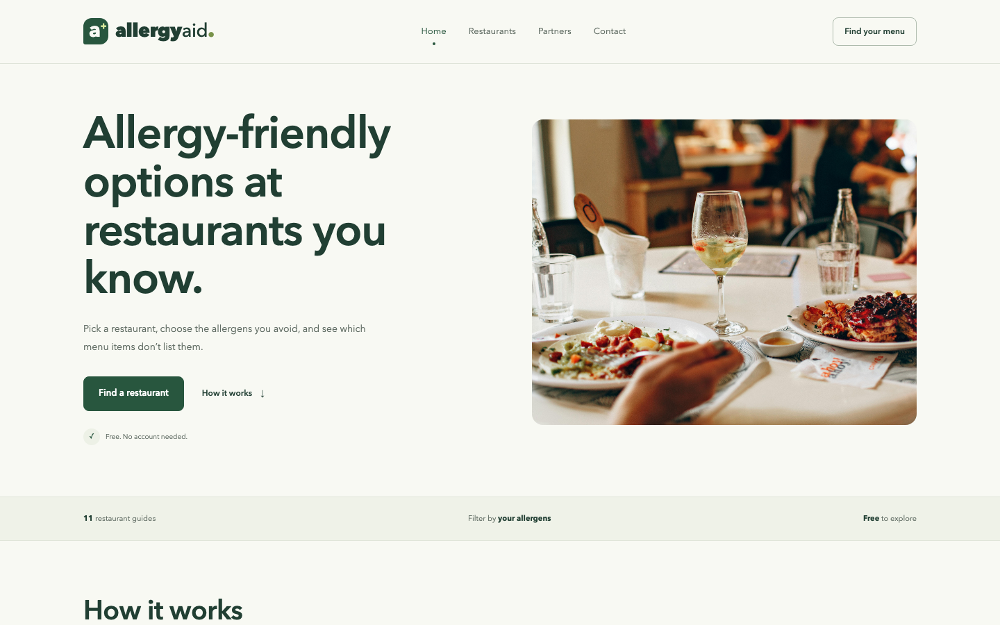
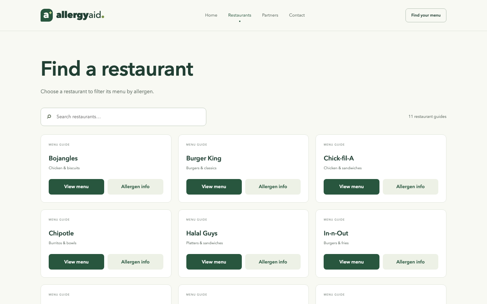
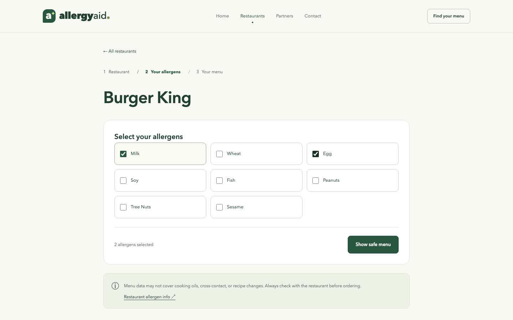
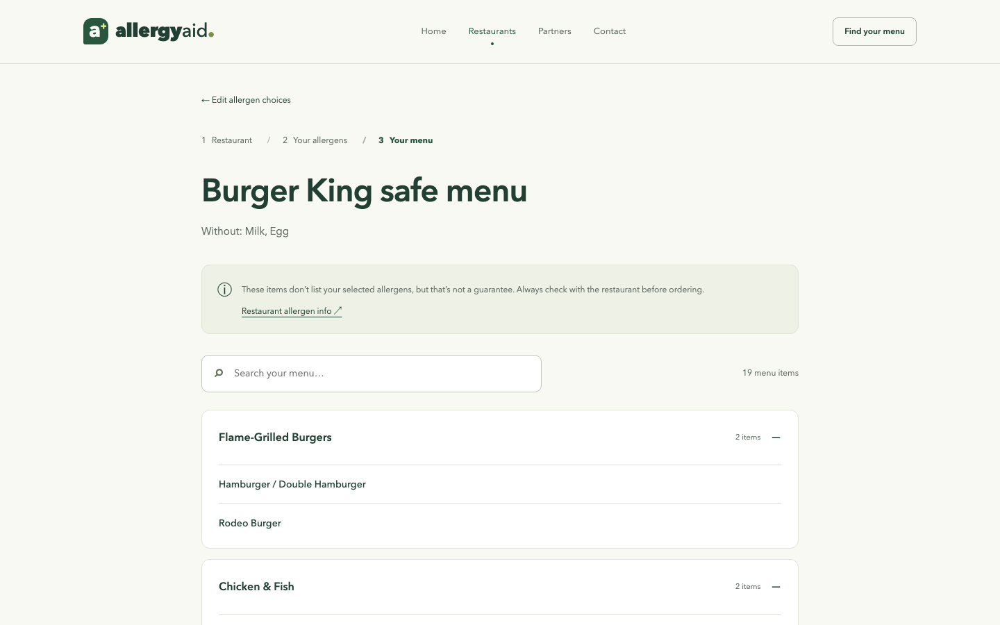
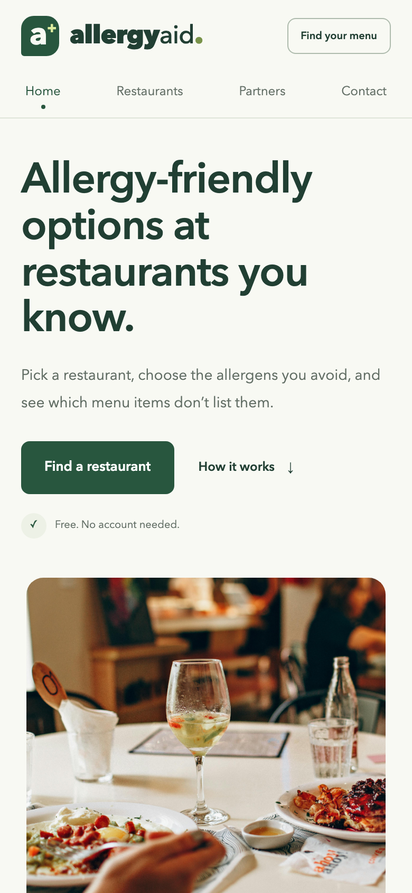

# Allergy Aid

**Live site:** https://allergy-aid.vercel.app/restaurants.html

Allergy Aid is a static, mobile-friendly web app that helps people with food allergies find menu items to consider at popular restaurants. Pick a restaurant, choose the allergens you need to avoid, and get that restaurant's menu filtered down to items whose stored allergen data doesn't list any of them.



> ⚠️ **Not medical advice.** Results come from the allergen data stored in this repo. They do not guarantee that food is allergen-free and do not account for cross-contact or recipe changes. Always confirm with the restaurant before ordering.

## How it works

1. **Find your restaurant** (`restaurants.html`): search or browse the supported restaurants.
2. **Choose your allergens** (`allergen-picker.html`): select from the allergens that restaurant's guide tracks.
3. **See your filtered menu** (`safe-menu.html`): browse items by category, with a link to the restaurant's own allergen source and notes on preparation and cross-contact.

Your selections are saved in session storage for the current tab, so you can go back and edit them without starting over.

### Supported restaurants

Bojangles · Burger King · Chick-fil-A · Chipotle · Halal Guys · In-N-Out · Jack in the Box · Long John Silver's · Panda Express · Popeyes · Raising Cane's

## Screenshots

| Find a restaurant | Choose allergens |
| --- | --- |
|  |  |

| Safe menu | Mobile |
| --- | --- |
|  |  |

## Features

- No build step and no dependencies: plain HTML, CSS, and JavaScript
- Responsive layout with keyboard-accessible controls
- Installable as a PWA (`manifest.json`), with an offline fallback page (`sw.js`, `offline.html`)
- Partner directory (`partners.html`) and a contact form (`contact.html`) powered by [FormSubmit](https://formsubmit.co)

## Run locally

Clone the repo and start any static web server from the project folder:

```sh
git clone https://github.com/jimmyc803/AllergyAid.git
cd AllergyAid
python3 -m http.server 4173 --bind 127.0.0.1
```

Then open http://127.0.0.1:4173.

Use a web server rather than opening the HTML files directly, because menus are loaded with `fetch`.

## Project structure

```
├── index.html              # Landing page
├── restaurants.html        # Restaurant search
├── allergen-picker.html    # Allergen selection
├── safe-menu.html          # Filtered menu results
├── partners.html           # Partner directory
├── contact.html            # Contact form
├── offline.html            # Offline fallback
├── css/site.css            # Shared styles, layouts, and accessibility
├── js/                     # Search, allergen selection, menu rendering, install support
├── data/                   # One JSON allergen guide per restaurant (+ template.json)
├── images/                 # Logos and app icons
└── manifest.json, sw.js    # PWA install and offline support
```

Paths are relative, so the site works at a domain root or under a subdirectory such as `/AllergyAid/`.

## Data disclaimer

The restaurant allergen data in `data/` is not automatically updated. Restaurants change recipes and suppliers, so review each guide against its official source regularly. The app shows items without your selected allergens **as listed in the stored data**. That is not a guarantee of safety.

## Contact

Questions, corrections, or partnership ideas? Use the [contact page](https://allergy-aid.vercel.app/contact.html) or email allergyaidteam@gmail.com.
